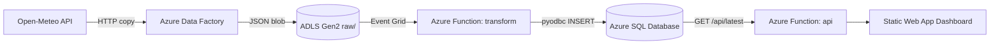

# Azure Data Pipeline

> Part of a multi-cloud data engineering pattern — see `PORTFOLIO.md` in the
> companion repos for the cross-cloud comparison. Same `shared/` ingest +
> transform logic as `aws-data-pipeline`, `gcp-data-pipeline`, and
> `k8s-airflow-data-platform`.

```
Open-Meteo API → Azure Data Factory → ADLS Gen2 → Azure Function → Azure SQL → Dashboard
```

## Architecture



## Components

| Component | Resource | Purpose |
|-----------|----------|---------|
| **Ingest** | Azure Data Factory (HTTP → ADLS Copy pipeline) | Pulls weather JSON from Open-Meteo into ADLS `raw/` container |
| **Landing zone** | ADLS Gen2 (`raw/weather/`) | Stores raw API responses as JSON blobs |
| **Transform** | Azure Function — Blob trigger via Event Grid | Flattens raw JSON → inserts row into Azure SQL |
| **Warehouse** | Azure SQL Database (serverless, auto-pause 60 min) | `weather_observations` table |
| **API** | Azure Function — HTTP trigger (`GET /api/latest`) | Returns latest observation as JSON |
| **Frontend** | Azure Static Web App (`frontend/index.html`) | Live dashboard with demo/live mode toggle |
| **IaC** | Terraform (`terraform/`) | Provisions all Azure resources |

## Quick Start

```bash
# 1. Clone
git clone https://github.com/mohammed-taha-el-ahmar/azure-data-pipeline.git
cd azure-data-pipeline

# 2. Install dependencies
uv sync --extra dev --extra functions

# 3. Run tests (no Azure credentials needed)
uv run pytest

# 4. Run the full pipeline locally (SQLite, no Azure)
uv run scripts/run_local_pipeline.py

# 5. Preview the frontend in demo mode
cd frontend && python -m http.server 8080
```

## Local Pipeline CLI

The script `scripts/run_local_pipeline.py` simulates the full Azure pipeline
on your machine using SQLite:

```bash
uv run scripts/run_local_pipeline.py              # single run
uv run scripts/run_local_pipeline.py --loop 30    # repeat every 30s
uv run scripts/run_local_pipeline.py --query      # print latest rows
uv run scripts/run_local_pipeline.py --reset      # clear local data
uv run scripts/run_local_pipeline.py -n 10        # show last 10 rows
```

## Deploy to Azure

Full step-by-step walkthrough: **[docs/demo.md](docs/demo.md)**

Summary:

```bash
# Provision infrastructure
cd terraform
cp terraform.tfvars.example terraform.tfvars   # set SQL password
terraform init && terraform apply

# Deploy functions
cd ../functions
cp -r ../shared ./shared
func azure functionapp publish "$(cd ../terraform && terraform output -raw transform_function_app)" --python --build remote

# Deploy frontend
swa deploy ./frontend --deployment-token "$TOKEN" --env production
```

See also: [docs/troubleshooting.md](docs/troubleshooting.md) |
[docs/useful-commands.md](docs/useful-commands.md)

## Project Structure

```
├── shared/                  # Cloud-agnostic ingest + transform logic
│   ├── ingest.py            # fetch_data(), to_raw_record(), raw_object_key()
│   └── transform.py         # transform_record(), WAREHOUSE_TABLE_DDL
├── functions/
│   ├── host.json            # Azure Functions runtime config
│   ├── requirements.txt     # Python deps for deployment
│   ├── transform/           # Blob trigger → Azure SQL
│   └── api/                 # HTTP trigger → GET /api/latest
├── frontend/
│   └── index.html           # Dashboard (demo + live mode)
├── data_factory/
│   └── pipeline_copy_to_adls.json   # ADF pipeline definition
├── terraform/               # All infrastructure as code
├── scripts/
│   └── run_local_pipeline.py  # Local pipeline runner
├── tests/
│   └── test_smoke.py        # 22 offline smoke tests
└── docs/
    ├── demo.md              # Full deployment walkthrough
    ├── architecture.md      # Architecture diagrams
    ├── troubleshooting.md   # Common issues & fixes
    └── useful-commands.md   # Handy CLI reference
```

## Testing

```bash
# Run all tests (offline, no credentials needed)
uv run pytest

# Run with coverage
uv run pytest --cov=shared --cov-report=term-missing

# Run live API tests (hits Open-Meteo)
RUN_LIVE_TESTS=1 uv run pytest
```

## CI

GitHub Actions runs on every push/PR:
- **Smoke tests** — Python 3.11 + 3.12 matrix
- **Lint** — `ruff check` + `ruff format --check`
- **Terraform validate** — `terraform fmt -check` + `terraform validate`

## Teardown

```bash
cd terraform && terraform destroy
uv run scripts/run_local_pipeline.py --reset   # clear local data
```
