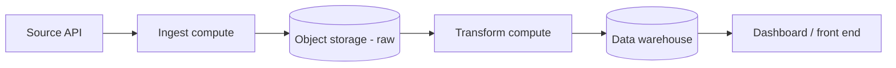
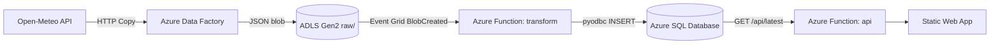

# Architecture

## Generic pattern

## Azure implementation

### Key design decisions

| Decision | Rationale |
|----------|-----------|
| HTTP connector (not REST) in ADF | REST connector fails on gzip-encoded responses from Open-Meteo |
| Event Grid blob trigger (not polling) | ADLS Gen2 with HNS requires Event Grid; polling doesn't detect blobs |
| `shared/` as cloud-agnostic module | Same ingest/transform code across Azure, AWS, GCP implementations |
| Auto-wrap in transform function | ADF writes raw API JSON; function wraps it to match `to_raw_record()` format |
| Serverless SQL (auto-pause 60 min) | Near-zero cost for demo; scales automatically for production |
| `--build remote` for func deploy | Avoids local/remote Python version mismatch (builds on Azure's 3.12) |

This repo is one leg of a multi-cloud pattern — see also `aws-data-pipeline`,
`gcp-data-pipeline`, and `k8s-airflow-data-platform`. Same `shared/` ingest +
transform logic, Azure-native wiring.
