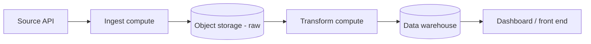
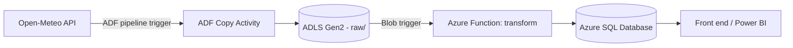

# Architecture

## Generic pattern

## Azure

This repo is one leg of a multi-cloud pattern — see also `aws-data-pipeline`,
`gcp-data-pipeline`, and `k8s-airflow-data-platform`. Same `shared/` ingest +
transform logic, Azure-native wiring.
